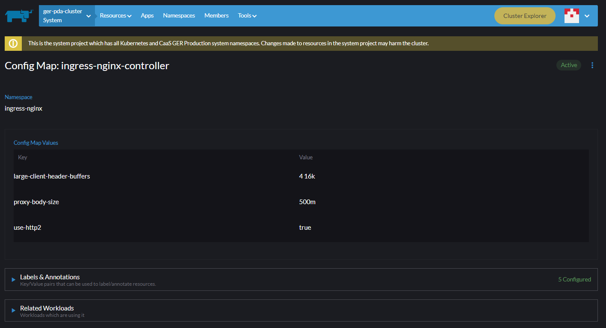

# Nginx - Header Too Large

The HTTP 431 Request Header Fields Too Large response status code indicates that the server refuses to process the request because the request's HTTP headers are too long. The request may be resubmitted after reducing the size of the request headers.

For more information about this refer to the [Mozilla Website](https://developer.mozilla.org/en-US/docs/Web/HTTP/Status/431).

## **Possible Causes**

431 can be used when:

- The `referer` URL is too long
- There are too many cookies sent to the request
- The total size of request headers is too large
- When a single header field is too large

## **Possible Solutions**

- Clear Cookies
- Try from Private Browsing Mode (essentially a clean session)

If these don't solve the issue for the user, than the problem is most likely in the service providing the website.

## **Instructions**

There are two places where we need to apply changes.

### nginx-ingress-controller

The first place is the ConfigMap of the `nginx-ingress-controller`.

It's located in the `ingress-nginx` namespace in the cluster under ConfigMaps.

Look for the `nginx-ingress-controller` ConfigMap and add the below lines under "data" change it to:

``` yaml
data:
  large-client-header-buffers: 64 256k
  proxy-body-size: 1000m
  use-http2: "true"
```



For more information about the `nginx-ingress-controller` go to [this page](https://docs.nginx.com/nginx-ingress-controller/configuration/global-configuration/configmap-resource/)

### **Application Ingress**

The other file we need to edit is the ingress of the application with the header issue (e.g. login service).

Navigate to the ingress of the application (for login service in dev it would be "daas-dev" namespace, and then edit the ingress file).


``` yaml
annotations:
  nginx.ingress.kubernetes.io/use-http2: "true"
  nginx.ingress.kubernetes.io/client_max_body_size: 1000m
  nginx.ingress.kubernetes.io/http2-protocol: "true"
  nginx.ingress.kubernetes.io/proxy-body-size: 1000m
  nginx.ingress.kubernetes.io/proxy-buffer-size: 16k
  nginx.ingress.kubernetes.io/proxy-buffering: "on"
  nginx.ingress.kubernetes.io/proxy-large-client-header-buffers: 64 256k
  nginx.ingress.kubernetes.io/ssl-protocols: TLSv1.2 TLSv1.3
  nginx.io/client_max_body_size: 1000m
  nginx.io/large-client-header-buffers: 64 256k
  nginx.io/proxy-body-size: 1000m
  ingress.kubernetes.io/client_max_body_size: 1000m
  ingress.kubernetes.io/proxy-body-size: 1000m
```

Save it and the issue should be resolved.

For more information about the ingress configuration go to [this page](https://docs.nginx.com/nginx-ingress-controller/configuration/ingress-resources/advanced-configuration-with-annotations/)
