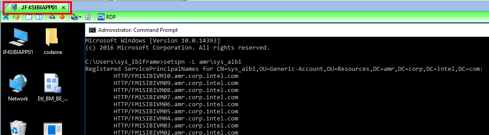

# Check SPN For machines

1. Open ASG Remote Desktop software and RDP into an AMR server
2. Run the below command:

```
setspn -L amr\sys_aibi
```

If the command worked you should be able to see all the servers registered to this user

