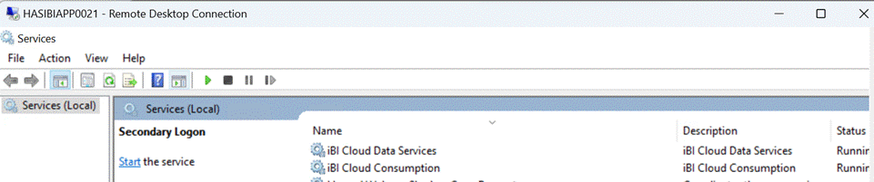

This wiki page will detail what to do in case of an ActiveMQ outage.

###  Possible Reasons
- The ActiveMQ host is out of memory due to high volume of large messages.
- ActiveMQ's storage is full.
- Too many open file descriptors.

To verify the ActiveMQ is indeed not working, please run the following iBI command:

```
ibi.exe health check --domain=qos --operation=activemq --params="site=FM"
```

In case of a problem, the health operation will show Violations in the Violations column.
For Example:


You can also check if it's responding in Hawtio Reader in the URL: [http://ibi-activemq-ui.iglb.intel.com/server/ibi-amq-fm.amr.corp.intel.com](http://ibi-activemq-ui.iglb.intel.com/server/ibi-amq-fm.amr.corp.intel.com):

IF Hawtio Reader gets a response from the ActiveMQ broker an issue might look like this:


Notice: Consumers and Producer counters are 0 because they disconnected.

## Fixing Steps

### 1. Restart ActiveMQ

Navigate to this web address
[http://10.184.5.49:30777/](http://10.184.5.49:30777/)

Login with the username and password:

Username: `flashforward`
Password: `flashforward`


You'll then be taken to the main page of Portainer.
You'll see all the environment that are marked in red.

- `ibi-amq-fm.amr.corp.intel.com`
- `scyarc107.sc.intel.com`


Click on the appropriate environment (`ibi-amq-fm.amr.corp.intel.com`).

Then in the side panel, click on `Containers`


Click on the `activemq_broker` name in the container list


Click on the "Restart" button to restart ActiveMQ.


After clicking on the restart wait for the prompt below to appear on the top right of the page:


After that give the broker 2 minutes to start and check again in Hawtio Reader ([http://ibi-activemq-ui.iglb.intel.com/server/ibi-amq-fm.amr.corp.intel.com](http://ibi-activemq-ui.iglb.intel.com/server/ibi-amq-fm.amr.corp.intel.com)) that the clients are connected again.

A healthy broker will show Enqueue and Dequeue counters that are close to one another.
(If there is a bit of lag in the first couple of minutes between the Enqueue and Dequeue that's ok as long as the Dequeue isn't stuck on 0).

Example:


### 2. Redirecting  Clients to IDC (disable in GLB)

> ⚠️ If the restart of the ActiveMQ broker didn't work and there is 0 Dequeue after a couple of minutes, we will have to take other steps to resolve this. if that's the case please continue following this guide.

Go to : [https://highwire.intel.com/#/gtmEnvironmentDetail/41](https://highwire.intel.com/#/gtmEnvironmentDetail/41 "https://highwire.intel.com/#/gtmenvironmentdetail/41")

Select `ibi-daas.hf.intel.com` -> and click on the "Disable" button in the top of the page.


### 3. Checking services reconnect to ActiveMQ

After disabling the GLB in HighWire, we need to make sure that services can connect to ActiveMQ again.
To check that before we restart the entire site using Azure DevOps, we'll restart a single service first.

1. Login to HASIBIAPP0021
2. Navigate to services and restart Consumption (iBI Cloud Consumption -> right click -> Restart).



3. Navigate back to [http://ibi-activemq-ui.iglb.intel.com/server/ibi-amq-fm.amr.corp.intel.com](http://ibi-activemq-ui.iglb.intel.com/server/ibi-amq-fm.amr.corp.intel.com) and check that consumers and producer numbers are rising (example of numbers – should be larger then 0/1)


3. Run this command to see that it works: 

```shell
ibi sql "select top 10 10 from [hello.hello]" --host=ibi-daas.hf.intel.com --debug --via=a8c54de9-70bc-4521-b24b-c5102a65ab97
```

We expect the command to return :


### 4. Restart all services using restart release pipeline 

Navigate to the Azure DevOps Page below and trigger all the pipelines that are marked in red.
[https://dev.azure.com/PDA-PDSS/iBI/_release?_a=releases&view=all&path=%5CDaaS](https://dev.azure.com/PDA-PDSS/iBI/_release?_a=releases&view=all&path=%5CDaaS):


### 5. Checking Services Are Working

After restarting all the services in the site using the pipelines make sure that the services are connected to ActiveMQ again.

Notice that enqueue and dequeue should be close to one another.


To verify the ActiveMQ is indeed working again, please run the following iBI command:

```
ibi.exe health check --domain=qos --operation=activemq --params="site=FM"
```

If everything is back to normal the health operation Violations column will not show errors.

For Example:


### 6. Enable back hf in highwire

Go to : [https://highwire.intel.com/#/gtmEnvironmentDetail/41](https://highwire.intel.com/#/gtmEnvironmentDetail/41 "https://highwire.intel.com/#/gtmenvironmentdetail/41")

Select `ibi-daas.hf.intel.com` -> and click on the "Enable" button in the top of the page.


